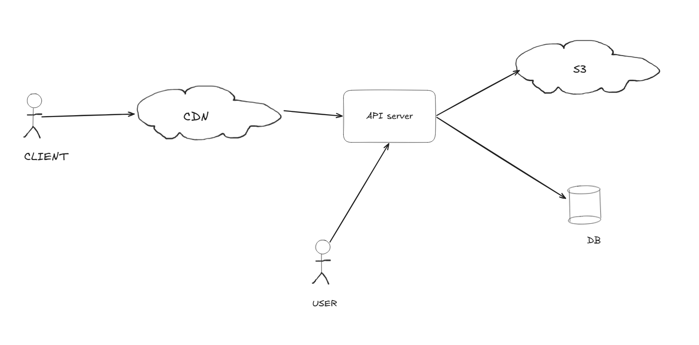

# 👤 Designing Gravatar & Media Services

A **Gravatar** (Globally Recognized Avatar) is a service providing a single, embeddable URL that represents a user's profile picture across multiple platforms. The engineering goal is to serve an image directly via a standard `` tag using a URL like `https://gravatar.com/username`.

---

## 🖼️ How Images are Served (The Fundamentals)

To understand Gravatar, we must first understand how a server "renders" an image:
1. **Request:** The browser hits a URL (e.g., `mywebsite.in/abc.png`).
2. **Handling:** The server handler parses the path and identifies the file.
3. **Reading:** The server reads the file from the storage/filesystem as **raw bytes**.
4. **Response:** The server sends these bytes back with the `Content-Type: image/png` header, allowing the browser to interpret the binary data as a visual image.

---

## 🏗️ Gravatar Architecture

Building a profile picture service requires a clean separation between binary storage and user metadata.

### 1. Storage & Schema
Photos are stored in an object store (like S3) using a predictable pathing strategy: `s3://images/<user_id>/<photo_id>.<ext>`.

**The Database Structure:**
* **Users Table:** `id`, `username`, `email`.
* **Photos Table:** `id`, `user_id`, `s3_path`, `created_at`, `is_active`.

### 2. The "Active Photo" Workflow
A user may upload many photos, but only one is their "Gravatar."
* **Serving:** When a request comes in for a user's image, the API fetches the photo where `user_id = X` and `is_active = true`.
* **Updating (Atomic Transaction):** To change a profile picture, we must use a database transaction to ensure consistency:
    1. Set `is_active = false` for all existing photos of the user.
    2. Set `is_active = true` for the newly selected photo.

---

## 🚀 Scaling with CDN & On-Demand Optimization

Serving images directly from an API server is inefficient. We use a **CDN** and **On-Demand Processing** to handle global scale.

### 1. Edge Caching
A CDN (Content Delivery Network) is placed in front of the API. When an image is requested, the CDN caches the raw bytes at "Edge" locations worldwide. Subsequent requests for the same image never reach your API or S3 bucket.

### 2. On-Demand Image Optimization (Image Proxy)
Modern apps need different versions of the same image (e.g., a 40px thumbnail vs. a 400px profile page). 
Instead of pre-generating thousands of files, we use **URL Parameters**:
`https://mywebsite.in/abc.png?w=240`

**The Flow:**
1. **CDN Check:** Does the cache have the "240px" version of `abc.png`?
2. **Miss:** If not, the request goes to an **Image Optimizer Service**.
3. **Transform:** The service fetches the original from S3, resizes it using a library like *ImageMagick* or *Sharp* based on the `w=240` parameter.
4. **Deliver & Cache:** The new version is sent to the user and cached by the CDN for future requests.

---

---

## 🛠️ Summary: Design Decisions

| Feature | Implementation |
| :--- | :--- |
| **Storage** | S3 (Object Store) for scalability. |
| **Metadata** | Relational DB for ACID transactions (active flag). |
| **Performance** | CDN for edge caching and reducing API load. |
| **Flexibility** | Dynamic Resizing via query parameters (e.g., `?w=240`). |

---

# 🏷️ Image Tagging & Real-time Unread Indicators

This section explores the geometry behind tagging people in photos and the high-performance data structures required to maintain unread message counts at scale.

---

## 📸 Tagging People on Photos

Tagging requires mapping a digital identity to a specific physical area within an image. We treat the image as a 2D plane to define "Face Boxes."

### 1. Coordinate Storage
To save a tag, we store two points that define a bounding box:
* **Top-Left:** $(x_1, y_1)$
* **Bottom-Right:** $(x_2, y_2)$

### 2. The Resolution Problem: Normalized Ratios
If we store coordinates as absolute pixels (e.g., $x=500$), the tag will drift if the image is resized or viewed on different devices (Mobile vs. Desktop).

**The Solution:** Store the **Normalized Ratio** ($0.0$ to $1.0$).
* **Ratio X:** `Absolute X / Total Width`
* **Ratio Y:** `Absolute Y / Total Height`

**The Flow:** The client-side calculates the real coordinates by multiplying the stored ratios by the current screen's resolution. This ensures the tag stays on the face regardless of the screen size.

---

## 🔴 The 'Newly Unread' Indicator

The goal is to show a "badge count" representing the number of **unique people** who have sent a user messages that remain unread.

### 🛠️ Requirements
* **Near-Real-Time:** The indicator must update as soon as a message is delivered.
* **Deduplication:** If one friend sends 50 messages, the unread count should only increase by **1**.

### ⚡ The Redis Implementation
We use **Redis Sets** because they automatically handle uniqueness and provide $O(1)$ performance for additions and counts.

**Structure:**
* **Key:** `unread_from:<UserID>`
* **Value:** A `SET` containing the IDs of senders.

**Example:**
If User `17238` has unread messages from three friends:
`unread_from:17238` -> `{1233, 1531, 7345}`
**Length (Count):** 3

---

## 🔄 API Logic & Workflow

| Action | API Endpoint | Logic |
| :--- | :--- | :--- |
| **New Message** | `POST /send` | `SADD unread_from:<ReceiverID> <SenderID>` |
| **Check Status** | `GET /status` | `SCARD unread_from:<UserID>` (Returns the set size). |
| **Acknowledge** | `POST /ack` | `DEL unread_from:<UserID>` (Clears the set when inbox is opened). |

---

## 📊 Summary Comparison

| Feature | Tagging Service | Unread Indicator |
| :--- | :--- | :--- |
| **Data Type** | Geometric Coordinates | User Identifiers |
| **Primary Goal** | Visual Accuracy | Real-time Synchronization |
| **Storage Choice** | Relational DB (Metadata) | Redis (High-speed KV) |
| **Optimization** | Normalized Ratios | Unique Sets (Deduplication) |

---
