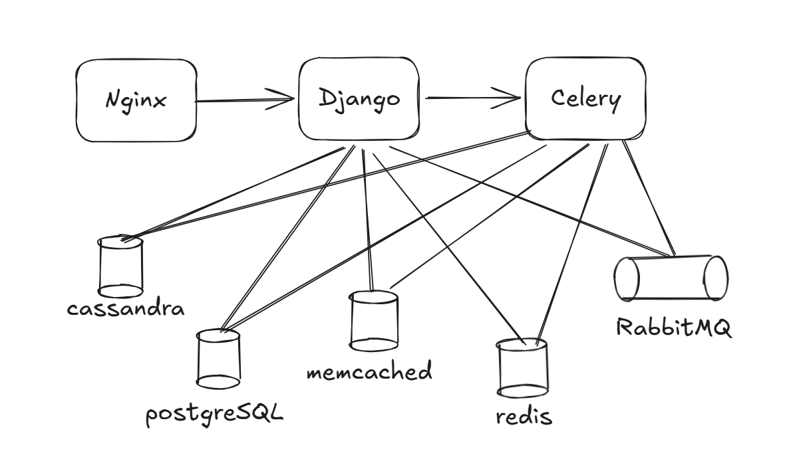

# 📸 Social Network Architecture: Image Service & Year 1 Scaling

Scaling a social network like Instagram involves moving from a simple monolith to a distributed architecture that handles massive binary data (images) and high-concurrency metadata.

---
## 📤 Instagram Year 1 Architecture

---
## 📤 Uploading Photos: The Pre-Publish Phase

The naive approach is `Client -> API -> S3`. This is inefficient because the image travels through your API server, consuming **double the bandwidth** (ingress and egress) and locking up worker threads.

### The Optimization: Pre-Signed URLs
1. **Request:** The client sends a request to the API: *"I want to upload a 5MB JPEG."*
2. **Authorize:** The API validates the user and requests a **Signed URL** from S3.
3. **Direct Upload:** The API returns the URL to the client. The client then uploads the image **directly to S3**.
4. **Finalize:** Once the upload is complete, the client sends the S3 link and metadata back to the API to be stored in the DB.

---

## 🛠️ Post-Publish: Image Optimization

Once the "original" image is in S3, we cannot serve a 5MB file to every mobile user. We must optimize it for different network speeds and screen sizes.

### The Processing Pipeline:
1. **Trigger:** The API sends a task to an **Optimizer Service** (often via a message queue).
2. **ImageMagick:** The service uses tools like *ImageMagick* to:
    * Strip EXIF metadata (Privacy).
    * Compress the file.
    * Generate multiple versions (Thumbnail, Medium, High-Res).
3. **Storage:** These copies are saved back to S3, and their unique URLs are mapped in the database.

---
# #️⃣ Hashtag Service & Event-Driven Architecture

A Hashtag service needs to handle three core responsibilities:
1.  **Storage:** Storing the hashtags themselves.
2.  **Aggregation:** Tracking the number of photos/posts per tag.
3.  **Discovery:** Providing fast access to the "Last 100 photos" for a specific tag.

---

## 🏗️ The Initial Flow (Simple Queue)

When a user posts a photo with hashtags, the system shouldn't block the user while it processes those tags. We use a **Message Broker (SQS)** to decouple the tasks.

**The Pipeline:**
1.  **Client:** Uploads post.
2.  **API:** Sends a message to **SQS**.
3.  **Tag Extractor:** A dedicated service pulls from SQS, parses the `#`, and updates the **Database**.

### ⚠️ The Scaling Problem: "The N+1 Queue"
As the system grows, other services (like **Analytics**, **Notification**, or **Safety/AI**) also need to know when a post is published. 
* **The Issue:** If we use a simple queue (SQS), once the Tag Extractor "consumes" the message, it's gone. To let other services see it, the API would have to send the same message to **multiple SQS queues**—one for every new service we build. This creates a massive bottleneck at the API layer.

---

## 🚌 The Solution: Event Bus (Kafka)

To solve the multi-consumer problem, we move to a **Publish/Subscribe (Pub/Sub)** model using an **Event Bus** like **Apache Kafka**.

### How it Works:
* **Publisher:** The API simply "fires and forgets" a single event (e.g., `PostCreated`) to a **Kafka Topic**.
* **Event Bus:** Kafka acts as a persistent log. It stores the event and allows multiple different services to read it at their own pace.
* **Subscribers (Consumers):** * **Hashtag Service** reads the event to index tags.
    * **Recommendation Engine** reads it to update user interests.
    * **Moderation Service** reads it to check for prohibited content.

---

## 📈 Designing for "Hot" Hashtags

When a tag goes viral (e.g., `#WorldCup`), the database can't handle millions of simultaneous increments.

1.  **Write Buffering:** Instead of updating the DB count for every single post, the **Tag Extractor** aggregates counts in-memory or in Redis for 10 seconds, then performs a "Batch Update" to the DB.
2.  **Retrieval (Last 100 Photos):** We maintain a **Linked List** or **ZSET (Sorted Set)** in Redis for each popular hashtag.
    * **Key:** `hashtag:worldcup`
    * **Value:** List of `PostIDs`, limited to 100 entries. 
    * When the 101st photo arrives, the oldest one is pushed out.

---

## 📊 Summary: SQS vs. Kafka (Event Bus)

| Feature | SQS (Simple Queue) | Kafka (Event Bus) |
| :--- | :--- | :--- |
| **Model** | One-to-One (Point-to-Point) | One-to-Many (Pub/Sub) |
| **Persistence** | Message deleted after consumption | Messages retained for a set period |
| **Complexity** | Low | High |
| **Use Case** | Task processing (e.g., Send Email) | System-wide state changes (e.g., Post Created) |

---
